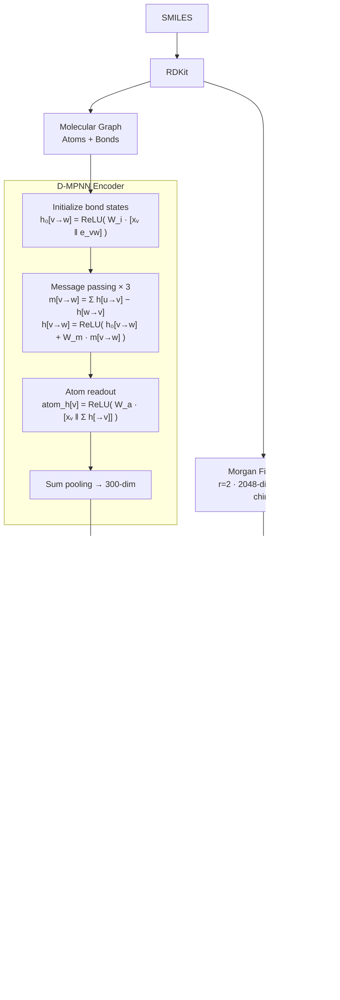

# ChemFF: Architecture & Results

**ChemFF** is a dual-branch neural network that encodes each molecule simultaneously as a molecular graph (via D-MPNN) and as a circular fingerprint vector (Morgan FP), then fuses both representations through a feedforward regression head to predict ionizable lipid transfection efficiency.

---

## Model Overview

---

## D-MPNN

The graph branch uses a **Directed Message Passing Neural Network** (Yang et al., 2019). Unlike standard MPNNs, each undirected bond is split into two directed edges so that every message excludes the information that came from the receiving atom — preventing a node from hearing its own signal reflected back.

### Bond initialization

$$h_0^{(vw)} = \text{ReLU}\!\left(W_i \cdot \left[x_v \;\|\; e_{vw}\right]\right)$$

- $x_v$ — source atom feature vector (133-dim)
- $e_{vw}$ — bond feature vector (14-dim)
- $W_i \in \mathbb{R}^{d \times 147}$, $d = 300$

### Message passing (T = 3 rounds)

At each round the message for directed bond $v \to w$ aggregates all hidden states incoming to $v$, then subtracts the reverse bond $w \to v$ to remove $v$'s own prior contribution:

$$m^{(vw)} = \sum_{u \in \mathcal{N}(v) \setminus w} h^{(uv)} = \underbrace{\sum_{u \in \mathcal{N}(v)} h^{(uv)}}_{\text{scatter\_add}} - h^{(wv)}$$

$$h^{(vw)} \leftarrow \text{ReLU}\!\left(h_0^{(vw)} + W_m \cdot m^{(vw)}\right)$$

All summations use `scatter_add` — no Python loops over atoms or bonds.

### Atom readout and pooling

Final bond states are folded back into atom representations, then sum-pooled per molecule:

$$\text{atom\_h}[v] = \text{ReLU}\!\left(W_a \cdot \left[x_v \;\|\; \sum_{w \to v} h^{(wv)}\right]\right)$$

$$z_{\text{graph}} = \sum_{v \in \text{mol}} \text{atom\_h}[v] \quad \in \mathbb{R}^{300}$$

A two-layer FFN projects $z_{\text{graph}}$ to the final 300-dim embedding.

---

## Molecular Features

### Atom features — 133 dimensions

| Feature | Encoding | Dims |
|---|---|---|
| Atomic number | one-hot [1–100] + other | 101 |
| Degree | one-hot [0–5] + other | 7 |
| Formal charge | scalar | 1 |
| Total H count | one-hot [0–4] + other | 6 |
| Radical electrons | scalar | 1 |
| Hybridization | one-hot SP/SP2/SP3/SP3D/SP3D2 + other | 6 |
| Is aromatic | scalar bool | 1 |
| Scaled mass | scalar (÷ 100) | 1 |
| Padding | — | 9 |

### Bond features — 14 dimensions

Each directed bond's input is `[atom_features(source) ‖ bond_features]` = 147 dims.

| Feature | Encoding | Dims |
|---|---|---|
| Bond type | one-hot single/double/triple/aromatic + other | 5 |
| Is conjugated | scalar bool | 1 |
| Is in ring | scalar bool | 1 |
| Stereo | one-hot NONE/ANY/Z/E/CIS/TRANS + other | 7 |

---

## Morgan Fingerprints

Morgan fingerprints iteratively assign each atom an identifier that encodes its neighbourhood out to radius $r$, then fold all identifiers into a fixed-length bit-vector (here count-based, not binary).

| Parameter | Value |
|---|---|
| Radius | 2 |
| Length | 2048 bits |
| Encoding | Count (integer, not binary) |
| Chirality | Enabled |

The output $f_{\text{fp}} \in \mathbb{R}^{2048}$ captures local chemical environments (functional groups, ring systems) that are complementary to the graph-level structural information learned by the D-MPNN.

---

## Fusion and Regression Head

The two embeddings are concatenated and passed through a three-hidden-layer MLP:

$$\hat{y} = \text{FFN}\!\left(\left[z_{\text{graph}} \;\|\; f_{\text{fp}}\right]\right), \quad \left[z_{\text{graph}} \;\|\; f_{\text{fp}}\right] \in \mathbb{R}^{2348}$$

| Layer | In → Out | Activation |
|---|---|---|
| 1 | 2348 → 1024 | ReLU + Dropout(0.1) |
| 2 | 1024 → 512 | ReLU + Dropout(0.1) |
| 3 | 512 → 256 | ReLU + Dropout(0.1) |
| 4 | 256 → 1 | — |

---

## Training

| Setting | Value |
|---|---|
| Optimizer | Adam |
| Learning rate | 2 × 10⁻⁴ |
| Batch size | 100 |
| Epochs | 100 |
| Loss | MSE |
| Target normalization | MinMax scaled to [−1, 1] |
| Mixed precision (AMP) | Supported |

---

## Dataset

All experiments use the **AGILE** ionizable lipid library: 1,100 molecules with experimentally measured transfection efficiencies for LNP-mediated RNA delivery. Inputs are SMILES strings; the target is a continuous scalar.

Three data-splitting strategies are evaluated to probe both interpolation and extrapolation ability:

| Split | Description |
|---|---|
| Random | IID 72 / 18 / 10 % partition |
| Murcko scaffold | Train and test sets share no Bemis–Murcko scaffolds |
| Balanced scaffold | Scaffold split with stratified cluster-size balancing |

---

## Results

Performance of ChemFF on the AGILE test set (random split):

| Metric | Value |
|---|---|
| R² | **0.8161** |
| Pearson r | **0.9053** |
| RMSE | reported in paper |
| MAE | reported in paper |

---

## Reference

> Asal Mehradfar, Mohammad Shahab Sepehri, et al.
> *LANTERN: A Machine Learning Framework for Lipid Nanoparticle Transfection Efficiency Prediction*, 2025.
> [arxiv.org/abs/2507.03209](https://arxiv.org/abs/2507.03209)
