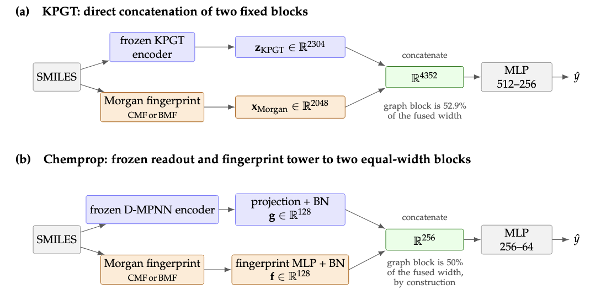

# MoFPGNN

**Morgan fingerprint fusion with graph-derived representations for predicting lipid nanoparticle transfection potency.**

MoFPGNN studies whether explicit molecular fingerprints improve predictions made from learned graph representations. Using ionizable lipids from the AGILE HeLa dataset, we combine count Morgan fingerprints (CMF) or binary Morgan fingerprints (BMF) with two graph models: **KPGT** and **Chemprop**.

The study compares each fusion model with both of its constituent baselines, evaluates potency prediction and candidate screening separately, and examines how much the fitted models rely on each representation.

## Code and documentation

The `main` branch is the project landing page. The implementations and their setup instructions are maintained on separate branches.

| Implementation | Code | Setup and usage |
|---|---|---|
| KPGT | [Browse the `kpgt` branch](https://github.com/Nuvine-World/MoFPGNN/tree/kpgt) | [KPGT README](https://github.com/Nuvine-World/MoFPGNN/blob/kpgt/README.md) |
| Chemprop | [Browse the `chemprop` branch](https://github.com/Nuvine-World/MoFPGNN/tree/chemprop) | [Chemprop README](https://github.com/Nuvine-World/MoFPGNN/blob/chemprop/README.md) |

## Fusion architectures



## Study design

| Item | Manuscript evaluation |
|---|---|
| Dataset | AGILE library of 1,100 ionizable lipids with measured mRNA transfection potency in HeLa cells |
| Input and target | Molecular structure as SMILES → transfection potency |
| Partition | Fixed random split: 880 training, 110 validation, and 110 test molecules |
| Fingerprints | Radius-2 Morgan fingerprints with 2,048 features; CMF retains counts and BMF records presence/absence |
| Model configurations | Five per pipeline: graph-only, two fingerprint-only, and two fusion models |
| Performance evaluation | Ten seeds per configuration: `0, 1, 2, 3, 4, 5, 6, 7, 23, 42` |
| Regression metrics | R², RMSE, MAE, Pearson correlation, and mean relative error |
| Screening metrics | EF, NDCG, and HitRate at the top 5% |
| Ranking estimation | Mean over 1,000 shared bootstrap resamples of the test set |
| Model comparisons | Two-sided paired tests across the same ten seeds |
| Representation reliance | Permutation, mean occlusion, and integrated gradients across five attribution seeds |

Preprocessing statistics are fitted on the training partition. Reported performance is mean ± sample standard deviation across training seeds on the fixed split; it describes repeatability within this evaluation rather than variation across alternative datasets or splits.

## Results reported in the manuscript

The table combines selected regression and screening results from the manuscript. Higher R² and EF@5% are better. EF measures enrichment relative to random selection, for which the expected value is 1.

| Pipeline | Model | R² | EF@5% |
|---|---|---:|---:|
| KPGT | MLP₇ + CMF | 0.623 ± 0.022 | 12.01 ± 0.80 |
| KPGT | MLP₇ + BMF | 0.558 ± 0.012 | 12.88 ± 1.48 |
| KPGT | KPGT | 0.667 ± 0.020 | 11.62 ± 0.22 |
| KPGT | KPGT + CMF | 0.739 ± 0.016 | **15.16 ± 0.26** |
| KPGT | KPGT + BMF | **0.742 ± 0.011** | 15.06 ± 0.22 |
| Chemprop | MLP₆ + CMF | 0.550 ± 0.026 | 12.76 ± 0.79 |
| Chemprop | MLP₆ + BMF | 0.514 ± 0.021 | 12.55 ± 0.72 |
| Chemprop | Chemprop | 0.550 ± 0.019 | 2.63 ± 2.07 |
| Chemprop | Chemprop + CMF | **0.624 ± 0.030** | **12.78 ± 0.37** |
| Chemprop | Chemprop + BMF | 0.610 ± 0.017 | 11.70 ± 1.85 |

Bold indicates the highest mean within each pipeline, not statistical significance. MLP₇ and MLP₆ are fingerprint-only predictors; subscripts count linear layers, including the output layer. The two pipelines use different baseline heads and training procedures.

## Get started

Choose an implementation and clone its branch into a separate directory.

**KPGT**

```bash
git clone --branch kpgt --single-branch https://github.com/Nuvine-World/MoFPGNN.git MoFPGNN-kpgt
cd MoFPGNN-kpgt
```

Follow the [KPGT setup and reproduction instructions](https://github.com/Nuvine-World/MoFPGNN/blob/kpgt/README.md) for environment installation, fingerprint generation, pretrained embedding extraction, model runs, seed sweeps, and attribution.

**Chemprop**

```bash
git clone --branch chemprop --single-branch https://github.com/Nuvine-World/MoFPGNN.git MoFPGNN-chemprop
cd MoFPGNN-chemprop
```

Follow the [Chemprop documentation](https://github.com/Nuvine-World/MoFPGNN/blob/chemprop/README.md) for its environment, data preparation, and training entry points.

The architecture diagram and result summary above follow the manuscript. Consult each implementation branch for its available scripts and configurations.
