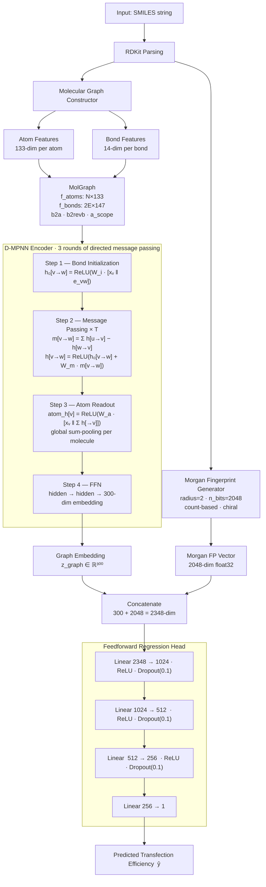

<h1 align="center">LANTERN</h1>
<h3 align="center">Lipid nANoparticle Transfection Efficiency pRedictioN</h3>

<p align="center">
  A machine learning framework for predicting transfection efficiency of ionizable lipids in LNP-mediated RNA delivery.<br/>
  Combines graph-based molecular encoding (D-MPNN) with Morgan fingerprints for state-of-the-art regression performance.
</p>

<p align="center">
  <a href="LICENSE"></a>
  
  
  
</p>

---

## Table of Contents

- [Overview](#overview)
- [Architecture](#architecture)
  - [System Diagram](#system-diagram)
  - [D-MPNN Encoder](#d-mpnn-encoder)
  - [Morgan Fingerprint Branch](#morgan-fingerprint-branch)
  - [Feedforward Head](#feedforward-head)
- [Dataset](#dataset)
- [Results](#results)
- [Project Structure](#project-structure)
- [Setup](#setup)
- [Usage](#usage)
- [Citation](#citation)

---

## Overview

**LANTERN** predicts the transfection efficiency of ionizable lipids used in lipid nanoparticle (LNP) formulations for RNA delivery. The core model — **ChemFF** — is a dual-branch neural network that jointly encodes a molecule as:

1. A **molecular graph** processed by a Directed Message Passing Neural Network (D-MPNN)
2. A **Morgan fingerprint** count vector encoding local chemical neighbourhoods

Both representations are concatenated and passed through a feedforward regression head to produce a single scalar efficiency prediction.

---

## Architecture

### System Diagram



---

### D-MPNN Encoder

The graph encoder follows the **Directed Message Passing Neural Network** formulation (Yang et al., 2019). Each undirected bond is split into two directed edges so that messages flow independently in each direction, eliminating the atom-to-itself message problem that affects standard MPNNs.

**Initialization**

Each directed bond `(v→w)` is initialized by concatenating the source atom features `x_v` with the bond features `e_vw`:

```
h₀[v→w] = ReLU( W_i · [x_v ‖ e_vw] )
```

**Message Passing (T = 3 rounds)**

At each step the message for bond `(v→w)` is the sum of all hidden states incoming to `v`, minus the reverse bond `(w→v)` to exclude the self-contribution:

```
m[v→w]  = Σ_{u ∈ N(v)\w}  h[u→v]
         = atom_incoming_sum[v] − h[w→v]

h'[v→w] = ReLU( h₀[v→w] + W_m · m[v→w] )
```

All summations are implemented with `scatter_add` on GPU tensors — no Python loops over atoms or bonds.

**Readout**

Final bond states are aggregated into per-atom representations, then sum-pooled per molecule:

```
atom_h[v] = ReLU( W_a · [x_v ‖ Σ_{w→v} h[w→v]] )
mol_vec   = Σ_v  atom_h[v]           (per molecule, via scatter_add)
```

A two-layer FFN then projects `mol_vec` to a **300-dim molecular embedding**.

**Atom Features — 133 dimensions**

| Feature | Encoding | Dims |
|---|---|---|
| Atomic number | one-hot over [1–100] + other | 101 |
| Degree | one-hot over [0–5] + other | 7 |
| Formal charge | scalar | 1 |
| Total H count | one-hot over [0–4] + other | 6 |
| Radical electrons | scalar | 1 |
| Hybridization | one-hot (SP / SP2 / SP3 / SP3D / SP3D2) + other | 6 |
| Is aromatic | scalar bool | 1 |
| Scaled mass | scalar (÷ 100) | 1 |
| Padding | — | 9 |
| **Total** | | **133** |

**Bond Features — 14 dimensions**

| Feature | Encoding | Dims |
|---|---|---|
| Bond type | one-hot (single / double / triple / aromatic) + other | 5 |
| Is conjugated | scalar bool | 1 |
| Is in ring | scalar bool | 1 |
| Stereo | one-hot (NONE / ANY / Z / E / CIS / TRANS) + other | 7 |
| **Total** | | **14** |

Each directed bond's input vector is `[atom_features(source) ‖ bond_features]` → **147 dims**.

---

### Morgan Fingerprint Branch

Morgan fingerprints encode the circular neighbourhood of each atom out to a given radius into a fixed-length count vector.

| Parameter | Value |
|---|---|
| Radius | 2 |
| Bits | 2048 |
| Encoding | Count-based (not binary) |
| Chirality | Enabled |

Fingerprints are pre-computed once and cached as a `{smiles: np.ndarray}` dictionary in `data/fingerprints/AGILE/morgan.pkl`, loaded in O(1) per molecule at training time.

---

### Feedforward Head

The concatenated 2348-dim vector `[z_graph ‖ f_fp]` is passed through a three-hidden-layer MLP:

```
2348 → Linear(2348, 1024) → ReLU → Dropout(0.1)
     → Linear(1024,  512) → ReLU → Dropout(0.1)
     → Linear( 512,  256) → ReLU → Dropout(0.1)
     → Linear( 256,    1)
```

**Training configuration**

| Hyperparameter | Value |
|---|---|
| Optimizer | Adam |
| Learning rate | 2 × 10⁻⁴ |
| Batch size | 100 |
| Epochs | 100 |
| Loss | MSE |
| Mixed precision (AMP) | Supported |
| Target normalization | MinMax (−1, 1) |

---

## Dataset

### AGILE

The primary dataset is the **AGILE** ionizable lipid library — 1,100 molecules with experimentally measured transfection efficiencies for LNP-mediated RNA delivery.

| Property | Value |
|---|---|
| Molecules | 1,100 |
| Input | SMILES string |
| Target | Transfection efficiency (continuous) |
| Source file | `data/AGILE.csv` |

### Pre-computed Features

Fingerprints are stored in `data/fingerprints/AGILE/` to avoid recomputation:

| File | Description | Size |
|---|---|---|
| `morgan.pkl` | Morgan count FP, r=2, 2048-bit | 8.7 MB |
| `morgan_canonical.pkl` | Canonical SMILES variant | 8.7 MB |
| `circular.pkl` | Circular FP, 1024-bit (DeepChem) | 17 MB |
| `expert.pkl` | RDKit descriptor set | 1.9 MB |
| `grover.pkl` | GROVER pre-trained embeddings | 20 MB |

### Data Splits

Three splitting strategies are provided in `data/splits/AGILE/` as pre-saved NumPy index arrays:

| Strategy | File | Description |
|---|---|---|
| Random | `random.npy` | IID 72 / 18 / 10 % split |
| Murcko scaffold | `Murcko_scaffold.npy` | Groups by Bemis–Murcko scaffold; tests generalization to novel scaffolds |
| Balanced scaffold | `scaffold_balanced.npy` | Scaffold split with stratified size balancing |

---

## Results

ChemFF on the AGILE test set (random split):

| Metric | Value |
|---|---|
| R² | **0.8161** |
| Pearson r | **0.9053** |

---

## Project Structure

```
LANTERN/
├── chemff/                        # ChemFF model (D-MPNN + Morgan + FFN)
│   ├── model.py                   # ConcatFFN — main model class
│   ├── train.py                   # Training loop, metrics, checkpointing
│   ├── dataset.py                 # MoleculeDataset, collate_fn
│   ├── config.yaml                # Model + training hyperparameters
│   ├── chemprop/
│   │   ├── model.py               # ChempropEncoder, DMPNNLayer
│   │   └── featurizer.py          # MolecularGraphFeaturizer, MolGraph
│   └── morgan/
│       └── featurizer.py          # MorganFeaturizer
│
├── pipeline/                      # Data preprocessing + orchestration
│   ├── preprocess.py              # MinMaxScaler, train/val/test split
│   ├── trainer.py                 # ModelTrainer (fit / evaluate / predict)
│   ├── result_saver.py            # Save metrics, predictions, plots
│   └── run_pipeline_from_config.py
│
├── models/                        # Additional model implementations
│   ├── neural_models.py           # FeedforwardRegressor, TransformerRegressor
│   ├── sklearn_models.py          # Scikit-learn wrappers
│   └── wrappers.py                # SklearnModelWrapper, PytorchModelWrapper
│
├── scripts/                       # CLI entry points
│   ├── extract_fingerprint.py     # Generate + cache fingerprints
│   ├── split_dataset.py           # Create train/val/test split indices
│   ├── run_pipeline.py            # Full pipeline from config
│   └── run_inference.py           # Load checkpoint, predict, evaluate
│
├── utils/                         # Shared utilities
│   ├── config.py                  # YAML config loaders
│   ├── data_utils.py              # Scaffold splitting, inverse transform
│   ├── scaffold.py                # Murcko scaffold utilities
│   ├── visual_utils.py            # Loss curves, regression plots
│   └── io_tools.py                # YAML / pickle I/O
│
├── data/
│   ├── AGILE.csv                  # Main dataset (1,100 molecules)
│   ├── fingerprints/AGILE/        # Pre-computed fingerprint caches
│   └── splits/AGILE/              # Pre-generated split indices
│
├── checkpoints/                   # Saved model weights
├── results/                       # Evaluation outputs + paper figures
├── experiments/                   # Experimental scripts
├── notebooks/                     # Jupyter analysis notebooks
├── docs/                          # MkDocs documentation source
├── reports/                       # LaTeX paper source
├── lantern.yml                    # Conda environment
└── requirements.txt               # Pip dependencies
```

---

## Setup

```bash
# Clone
git clone https://github.com/AsalMehradfar/LANTERN.git
cd LANTERN

# Create conda environment
conda env create -f lantern.yml
conda activate lantern
```

---

## Usage

### 1. Prepare Your Data

Place your dataset at `data/YOUR_DATASET.csv` with at least:

- `SMILES` — molecular structure in SMILES format
- `Target` *(optional)* — ground truth value for evaluation

### 2. Generate Splits and Fingerprints

```bash
# Train/val/test split indices
python scripts/split_dataset.py --dataset YOUR_DATASET --mode random

# Pre-compute fingerprints (cached to disk, run once)
python scripts/extract_fingerprint.py --mode circular --data_name YOUR_DATASET --save_path data/fingerprints/YOUR_DATASET
python scripts/extract_fingerprint.py --mode expert   --data_name YOUR_DATASET --save_path data/fingerprints/YOUR_DATASET
```

### 3. Train ChemFF

```bash
python -m chemff.train --config chemff/config.yaml
```

Checkpoints are saved to `checkpoints/chemff/`.

### 4. Run Inference

```bash
# Predict on a CSV; computes metrics if Target column is present
python scripts/run_inference.py --csv_path data/YOUR_DATASET.csv
```

### 5. Full Pipeline from Config

```bash
python pipeline/run_pipeline_from_config.py config/train_config.yaml
```

---

## Citation

```bibtex
@article{Mehradfar2025LANTERN,
  title   = {LANTERN: A Machine Learning Framework for Lipid Nanoparticle Transfection Efficiency Prediction},
  author  = {Asal Mehradfar and Mohammad Shahab Sepehri and Jose Miguel Hernandez-Lobato
             and Glen S. Kwon and Mahdi Soltanolkotabi and Salman Avestimehr
             and Morteza Rasoulianboroujeni},
  year    = {2025},
  url     = {https://arxiv.org/abs/2507.03209}
}
```
